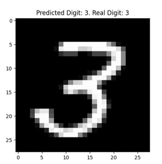
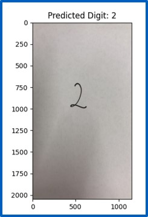
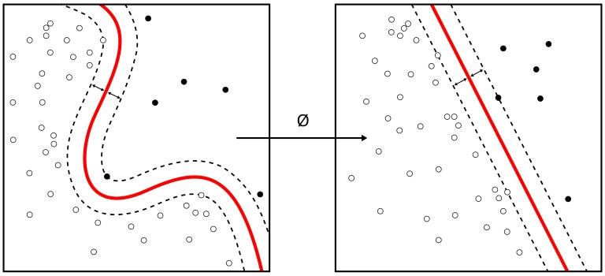

# ML-Handwritten-character-recognition

Having to type out a handwritten document can be a time-consuming and cumbersome task that anyone would like to avoid, to the extent possible. Consequently, this project's goal is to train and adjust a Neuronal Network to be able to recognize handwritten alphanumerical characters and, if possible, words.

Additionally, this tool could be used to help collectives with special needs, such as blind people, by reading out loud a handwritten document. As an annex to the project's main goal, if time is not too harsh with us and the NN works satisfactorily, we would like to automatize the process of sending the predicted alphanumerical characters to any voice algorithm, such as Google Translator, in order for it to read it out loud. This has not yet been implemented.

  
  

# The Algorithm: Support Vector Machine (SVM)

SVM (Support Vector Machine) is a classification and regression technique suitable for problems in which the analysis of data involves a reasonably extensive number of relevant characteristics.

## How SVM Operates

The general idea of how SVM operates is based on mapping the data into a high-dimensional vector space. Using this method, each data element can be associated with a point. When all the points are set and the data has been separated into categories, a hypersurface that discriminates between categories arises. This hypersurface needs to be transformed into a hyperplane for optimal error processing. Finally, new data can be tested to predict the class it belongs to.

## Kernel Functions

The mathematical object that transforms hypersurfaces into hyperplanes is known as a kernel function. Some of the most common kernel functions are: Linear, Polynomial, and Sigmoid.

The usage of one or the other depends on the complexity of the problem, and it is usually recommended to test all of them to see which one performs better.

# Future work

The current code is being perfectioned to try to adapt the pre-processing of the image input by the user with the aim of assuring better performance when the digit that needs to be predicted is not a digit from MNIST.

This code will be generalized to the prediction of alphanumerical characters by using the EMNIST dataset. 
Moreover, we aim at developing our own Newral Network to avoid using the algorithms implemented on well-known libraries. Even thought it is likely that our NN will not perform as good, it will be a great coding exercice.

# Comments on the use

Please note that the code 'number_predictor_data_augmentation_gridsearch.py' incorporates a gridsearch routine. If you aim at performing a quick test of the code, consider commenting that part of the code when running it since it is very time consumming.
